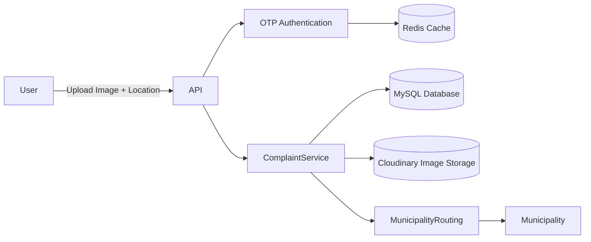

# CivicFix -- Geo-Based Civic Complaint Platform

CivicFix is a backend system that enables citizens to report civic
issues such as garbage or sanitation problems using **image evidence and
live location data**.\
The platform automatically routes complaints to the correct municipality
using geo-coordinates and prevents duplicate submissions using spatial
validation.

------------------------------------------------------------------------

## Features

-   OTP-based authentication using **Redis**
-   Secure REST APIs with **JWT authentication**
-   Geo-location based complaint routing to municipalities
-   Image upload and storage using **Cloudinary**
-   Duplicate complaint detection using **spatial validation (100m
    radius + time window)**
-   Redis caching for fast OTP verification
-   Dockerized development environment

------------------------------------------------------------------------

## Tech Stack

**Backend:** Java, Spring Boot, Spring Security, REST APIs,
Hibernate/JPA\
**Database:** MySQL\
**Caching:** Redis\
**DevOps:** Docker\
**Media Storage:** Cloudinary

------------------------------------------------------------------------

## System Architecture



------------------------------------------------------------------------

## API Flow

### Send OTP

POST /api/auth/send-otp

``` json
{
  "phone": "9999999999"
}
```

### Verify OTP

POST /api/auth/verify-otp

``` json
{
  "token": "JWT_TOKEN"
}
```

### Upload Image

POST /api/upload\
(Form Data: file=image.jpg)

Response:

``` json
{
  "imageUrl": "cloudinary_url"
}
```

### Create Complaint

POST /api/complaints

``` json
{
  "imageUrl": "cloudinary_url",
  "latitude": 28.6139,
  "longitude": 77.2090,
  "description": "Garbage on road"
}
```

------------------------------------------------------------------------

## Local Setup

### Clone Repository

    git clone https://github.com/RajeevRanjany/CivicFix.git
    cd CivicFix

### Run Redis

    docker run -p 6379:6379 redis

### Configure Application

Create `application.properties` inside:

`src/main/resources/`

Example:

    spring.datasource.url=jdbc:mysql://localhost:3306/civicfix
    spring.datasource.username=your_username
    spring.datasource.password=your_password

    spring.data.redis.host=localhost
    spring.data.redis.port=6379

    cloudinary.cloud-name=your_cloud_name
    cloudinary.api-key=your_api_key
    cloudinary.api-secret=your_api_secret

    jwt.secret=your_secret

### Run Application

    mvn spring-boot:run

------------------------------------------------------------------------

## Author

**Rajeev Ranjan**\
GitHub: https://github.com/RajeevRanjany
